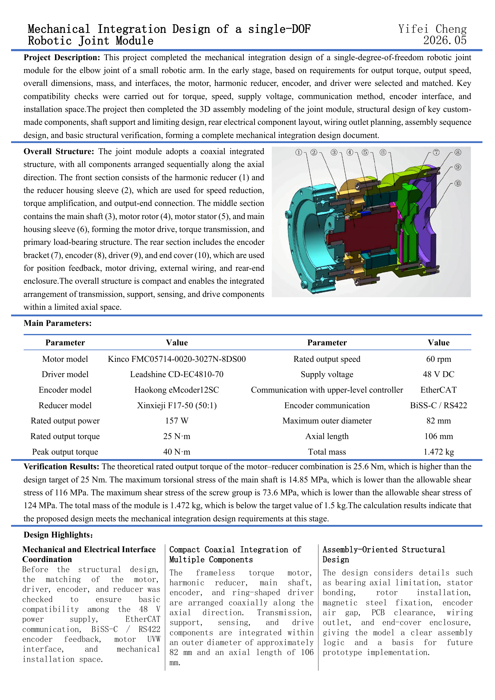

# Mechanical-Integration-Design-of-a-single-DOF-Robotic-Joint-Module

Mechanical integration design of a single-DOF robotic joint actuator module, including component selection, coaxial packaging, 3D CAD assembly, interface matching, structural verification, and documentation.

## Notes on Commercial Components

This project focuses on the mechanical integration design of a single-DOF robotic joint module. Commercial components used in the design, including the motor, harmonic reducer, encoder, and driver, are not self-developed components.

The original SolidWorks files of the motor and harmonic reducer are not included in this repository. The encoder and driver models shown in the assembly are simplified envelope models created only according to their basic dimensional information, and are used for layout, space checking, and interface illustration.

These simplified models are not official supplier CAD models and should not be used as manufacturing references. Product names and model numbers are used only for component identification and compatibility description.

## Repository Structure

- `docs/`: Chinese design report
- `drawing/`: assembly and key part drawings
- `images/`: overview, assembly, and exploded-view figures
- `cad/custom-parts/`: self-designed SolidWorks part files
- `cad/simplified-commercial-components/`: simplified envelope models of commercial components

## Project Overview

